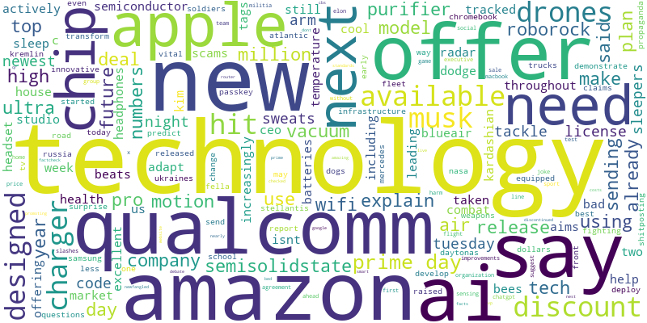

# News Topic Modeling

This repository contains a project focused on analyzing technology news articles using topic modeling techniques, specifically employing the Latent Dirichlet Allocation (LDA) model. The project fetches articles from a news API, processes the text data, and generates visualizations to reveal underlying topics in the news articles.

## Table of Contents

- [Features](#features)
- [Getting Started](#getting-started)
- [Prerequisites](#prerequisites)
- [Installation](#installation)
- [Data Collection](#data-collection)
- [Data Cleaning](#data-cleaning)
- [Topic Modeling](#topic-modeling)
- [Word Cloud Generatiom](#word-cloud-generation)
- [Interactive HTML](#interative-html)
- [LDA Visualizations](#lda-visualizations)
- [Top Topics Visualization](#top-topics-visualization)
- [Results](#results)
- [License](#license)

## Features

- Fetches technology news articles using the News API.
- Cleans and preprocesses text data for analysis.
- Applies LDA to identify topics within the articles.
- Generates a word cloud visualization of frequently occurring words.
- Creates an interactive HTML report with links to related news articles.

## Getting Started

To get a local copy up and running follow these simple steps.

### Prerequisites

Make sure you have the following installed:

- Python 3.x
- pip
- Git (to clone the repository)

### Installation

1. **Clone the Repository:**

   Open your terminal and run:

   ```bash
   git clone https://github.com/yourusername/news-topic-modeling.git
   cd news-topic-modeling
      
  2. **Install required libraries:**

     Install the necessary Python libraries by running:

     ```bash
     pip install wordcloud matplotlib requests nltk gensim pyLDAvis
     
  3. **Download necessary NLTK resources:**

     ```python
     import nltk
     nltk.download('stopwords')

# Data Collection


## Data Cleaning

Each article's content is cleaned by:

  - Removing URLs, mentions, and hashtags
  - Removing punctuation and numbers
  - Converting to lowercase and removing stopwords

    ```python
    def clean_text(text):
       text = re.sub(r'http\S+|www\S+|https\S+', '', text, flags=re.MULTILINE)  # Remove URLs
       text = re.sub(r'\@\w+|\#', '', text)  # Remove mentions and hashtags
       text = re.sub(r'[^a-zA-Z\s]', '', text)  # Remove punctuation and numbers
       text = text.lower()  # Convert to lowercase
       return ' '.join([word for word in text.split() if word not in stop_words])  # Remove stopwords

## Topic Modeling

   Using Gensim's LDA model, the script discovers topics within the article content. You can adjust the number of topics by modifying num_topics.

      ```python
      # Building and training the LDA model
      lda_model = gensim.models.LdaModel(corpus, num_topics=15, id2word=dictionary, passes=15)

## Word Cloud Generation

A word cloud of the top words across all topics is generated, saved to word_cloud.png, and displayed.

         wordcloud = WordCloud(width=800, height=400,       background_color='white').generate(wordcloud_text)
         wordcloud.to_file('word_cloud.png')
      



## Interactive HTML

The clickable word cloud (word_cloud.html) links each prominent word to a Google News search, offering a quick way to explore related news articles.


## LDA Visualization

The model visualization (lda_visualization.html) uses pyLDAvis to display interactive topic clusters and word importance.

      ```python
      pyLDAvis.save_html(vis, 'lda_visualization.html')


## Top Topics Visualization

A bar chart displays the average score of the top 5 topics, showing their relative prominence in the dataset.

      ```python
      plt.barh(top_topic_names, top_scores, color='skyblue')


## Results

The project generates insightful visualizations that help in understanding the trending topics in technology based on the news articles fetched. The word cloud gives a quick overview of the most prevalent terms, while the LDA visualization helps in diving deeper into the underlying topics.

## License

This project is licensed under the MIT License. See the [LICENSE](https://opensource.org/license/mit) file for more details.


 Data Collection
This script uses the News API to fetch the latest articles. Replace API_KEY in the code with your News API key.

python
Copy code
# Querying the API
url = f'https://newsapi.org/v2/everything?q=technology&apiKey={API_KEY}'
response = requests.get(url)
data = response.json()
Data Cleaning
Each article's content is cleaned by:

Removing URLs, mentions, and hashtags
Removing punctuation and numbers
Converting to lowercase and removing stopwords
python
Copy code
def clean_text(text):
    text = re.sub(r'http\S+|www\S+|https\S+', '', text, flags=re.MULTILINE)  # Remove URLs
    text = re.sub(r'\@\w+|\#', '', text)  # Remove mentions and hashtags
    text = re.sub(r'[^a-zA-Z\s]', '', text)  # Remove punctuation and numbers
    text = text.lower()  # Convert to lowercase
    return ' '.join([word for word in text.split() if word not in stop_words])  # Remove stopwords
Topic Modeling
Using Gensim's LDA model, the script discovers topics within the article content. You can adjust the number of topics by modifying num_topics.

python
Copy code
# Building and training the LDA model
lda_model = gensim.models.LdaModel(corpus, num_topics=15, id2word=dictionary, passes=15)
Word Cloud Generation
A word cloud of the top words across all topics is generated, saved to word_cloud.png, and displayed.

python
Copy code
wordcloud = WordCloud(width=800, height=400, background_color='white').generate(wordcloud_text)
wordcloud.to_file('word_cloud.png')


Interactive HTML
The clickable word cloud (word_cloud.html) links each prominent word to a Google News search, offering a quick way to explore related news articles.


LDA Visualization
The model visualization (lda_visualization.html) uses pyLDAvis to display interactive topic clusters and word importance.

python
Copy code
pyLDAvis.save_html(vis, 'lda_visualization.html')


Top Topics Visualization
A bar chart displays the average score of the top 5 topics, showing their relative prominence in the dataset.

python
Copy code
plt.barh(top_topic_names, top_scores, color='skyblue')


Results
The project generates insightful visualizations that help in understanding the trending topics in technology based on the news articles fetched. The word cloud gives a quick overview of the most prevalent terms, while the LDA visualization helps in diving deeper into the underlying topics.

License
This project is licensed under the MIT License. See the LICENSE file for more details.

sql
Copy code

### Key Formatting Changes:
1. **Code Blocks**: All Python code snippets are properly enclosed in triple backticks with the language specified for correct syntax highlighting.
2. **Section Titles**: Adjusted the section titles to ensure they match the content (e.g., corrected "Word Cloud Generatiom" to "Word Cloud Generation").
3. **Table of Contents**: Adjusted links to ensure consistency with the section names.
4. **Content Arrangement**: Structured the content for clarity and ease of reading.

This should make your README clear and easy to follow! If you need further adjustments or additions, feel free to ask!


ChatGPT can make mistakes. Check important info.     


